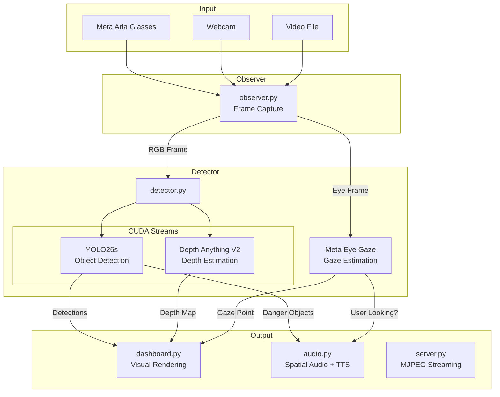
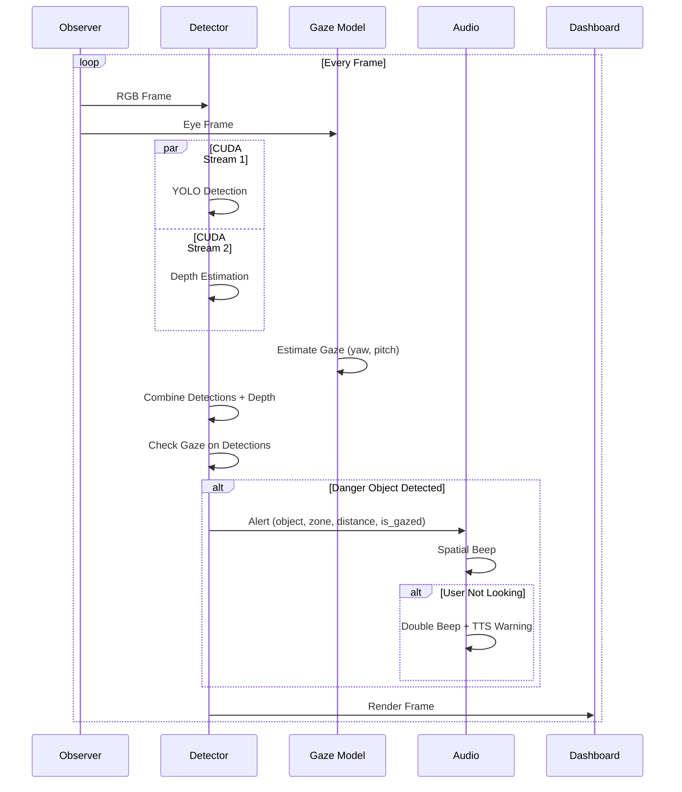
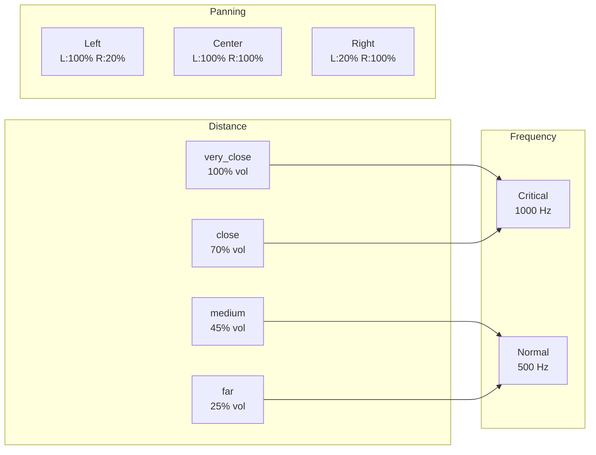
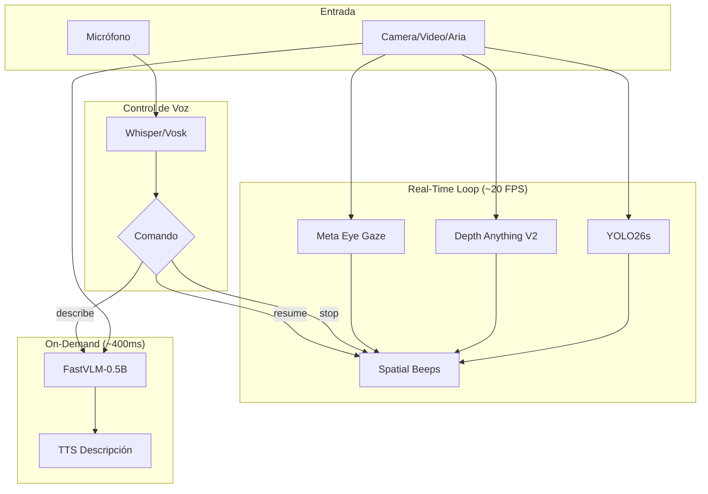
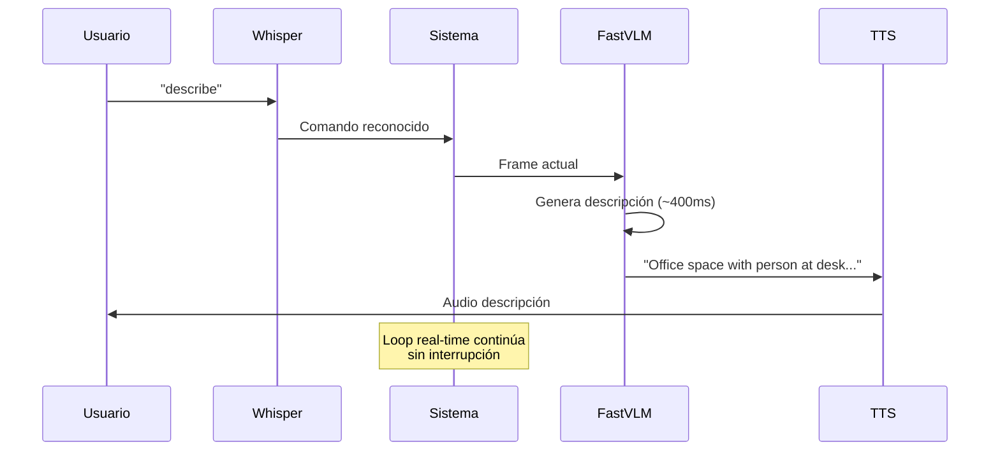
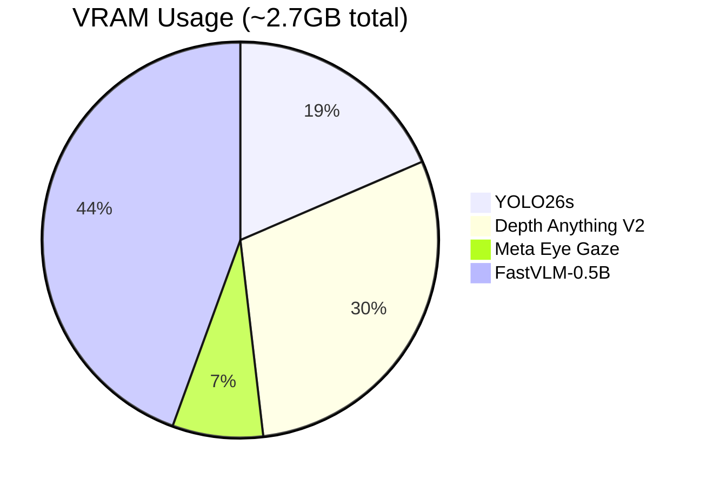

# ARIA Demo

Demo de asistencia visual para gafas Meta Aria: detección de objetos en tiempo real + estimación de profundidad + eye tracking + feedback audio espacial.

## Características

- **YOLO26s** - Detección de objetos con GPU
- **Depth Anything V2** - Estimación de profundidad monocular (FP16)
- **Meta Eye Gaze** - Modelo oficial de Meta para estimación de mirada (`projectaria_eyetracking`)
- **Audio Espacial** - Beeps direccionales (izq/centro/der) + TTS
- **CUDA Streams** - YOLO y Depth ejecutándose en paralelo
- **Gaze-Aware Alerts** - Alertas más intensas para objetos no vistos por el usuario

## Arquitectura



## Pipeline de Procesamiento



## Sistema de Audio



## Estructura del Proyecto

```
aria-demo/
├── demo.py          # Script principal (Gradio/OpenCV UI)
├── server.py        # Servidor MJPEG para streaming web
├── observer.py      # Captura de frames (Aria/Webcam/Video)
├── detector.py      # YOLO + Depth + Gaze (CUDA streams)
├── dashboard.py     # Renderizado visual con OpenCV
├── audio.py         # Feedback auditivo (beeps + TTS)
├── benchmark.py     # Benchmarks de rendimiento
├── requirements.txt # Dependencias
└── README.md
```

## Instalación

```bash
# Clonar/crear entorno
cd aria-demo
python -m venv .venv
source .venv/bin/activate

# Dependencias base
pip install -r requirements.txt

# Meta Eye Gaze Model (opcional, para gafas Aria)
pip install git+https://github.com/facebookresearch/projectaria_eyetracking.git

# Audio en Linux
sudo apt-get install -y libportaudio2 portaudio19-dev espeak-ng
```

## Uso

### Modo Interactivo (Gradio)

```bash
python demo.py                    # Menú interactivo
python demo.py --webcam           # Webcam directa
python demo.py --video video.mp4  # Video
python demo.py --aria             # Gafas Aria
```

### Servidor Web (MJPEG Streaming)

```bash
python server.py test_video.mp4   # Streaming en http://localhost:5000
```

### Opciones

| Opción | Descripción |
|--------|-------------|
| `--aria` | Conectar con gafas Meta Aria |
| `--webcam` | Usar webcam del sistema |
| `--video PATH` | Usar archivo de video |
| `--no-audio` | Desactivar feedback de audio |
| `--no-depth` | Desactivar estimación de profundidad |
| `--opencv` | Usar OpenCV en vez de Gradio |
| `--share` | Compartir Gradio públicamente |

## Controles

- `q` - Salir
- `s` - Scan de escena (anuncia todos los objetos)

## Detecciones

Cada objeto detectado incluye:

| Campo | Descripción |
|-------|-------------|
| `name` | Clase del objeto (person, chair, etc.) |
| `confidence` | Confianza de detección (0.0-1.0) |
| `bbox` | Bounding box (x, y, w, h) |
| `zone` | Zona espacial (left, center, right) |
| `distance` | Categoría de distancia (very_close, close, medium, far) |
| `depth_value` | Valor de profundidad normalizado (0.0-1.0) |
| `is_gazed` | True si el usuario está mirando el objeto |

## Rendimiento

Probado en RTX 3090:
- **15-19 FPS** con YOLO + Depth + Gaze
- **~25 FPS** sin profundidad
- **~30 FPS** solo YOLO

## Dependencias

```
numpy>=1.24.0
opencv-python>=4.8.0
torch>=2.0.0
ultralytics>=8.0.0
transformers>=4.35.0
gradio>=4.0.0
sounddevice>=0.4.6
pyttsx3>=2.90
Pillow>=10.0.0
```

## Roadmap: VLM + Control por Voz

Próxima integración: FastVLM para descripciones de escena + comandos de voz.

### Arquitectura Completa (Planned)



### Flujo de Voz



### Modelos y VRAM



### Comandos de Voz (Planned)

| Comando | Acción |
|---------|--------|
| "describe" / "scan" | Descripción VLM detallada |
| "stop" | Pausar alertas de audio |
| "resume" | Reanudar alertas |
| "help" | Listar comandos disponibles |

## Créditos

- [Ultralytics YOLO](https://github.com/ultralytics/ultralytics)
- [Depth Anything V2](https://github.com/DepthAnything/Depth-Anything-V2)
- [Meta Project Aria](https://www.projectaria.com/)
- [projectaria_eyetracking](https://github.com/facebookresearch/projectaria_eyetracking)
- [FastVLM](https://github.com/apple/ml-fastvlm) (planned)
