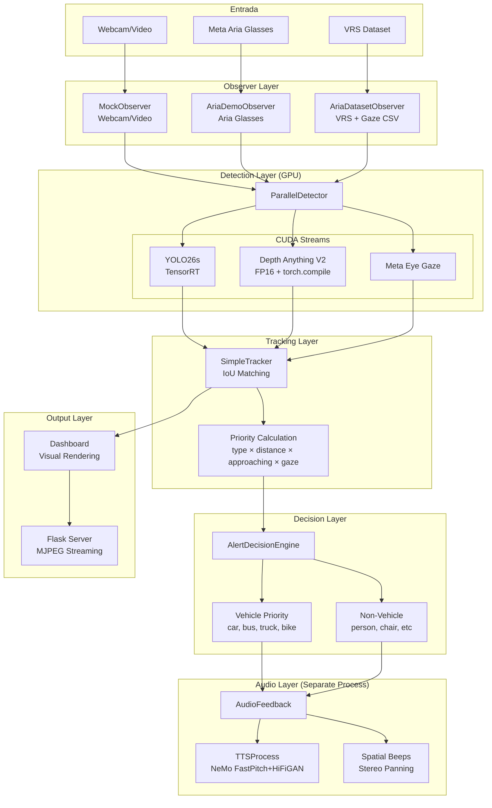
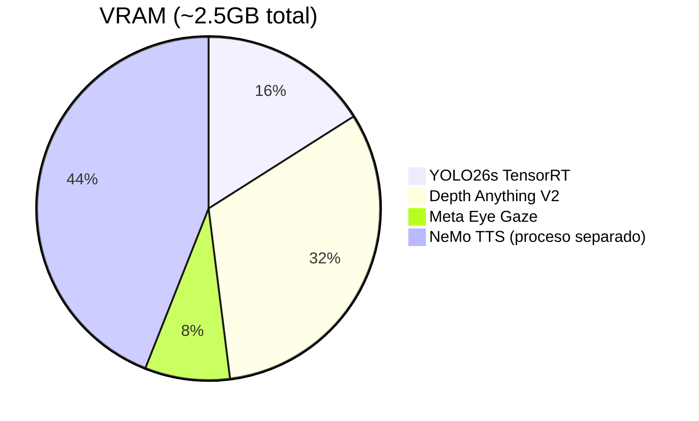

# ARIA Demo

Demo de asistencia visual para gafas Meta Aria: detección de objetos en tiempo real + estimación de profundidad + eye tracking + tracking temporal + alertas inteligentes.

## Características

- **YOLO26s** - Detección de objetos con GPU (TensorRT/PyTorch)
- **Depth Anything V2** - Estimación de profundidad monocular (FP16/torch.compile)
- **Meta Eye Gaze** - Modelo oficial de Meta para estimación de mirada
- **SimpleTracker** - Tracking de objetos entre frames con IoU matching
- **AlertDecisionEngine** - Sistema de decisión de alertas con priorización
- **NeMo TTS** - Síntesis de voz en proceso separado (aislamiento CUDA)
- **Audio Espacial** - Beeps direccionales (izq/centro/der) según posición
- **Gaze-Aware Alerts** - Alertas solo para objetos no vistos por el usuario

## Arquitectura General



## Pipeline de Procesamiento


## Sistema de Tracking

### SimpleTracker

Tracking de objetos entre frames usando IoU (Intersection over Union):


### TrackedObject

```python
@dataclass
class TrackedObject:
    id: int                    # Unique track ID
    name: str                  # Object class (person, car, etc)
    bbox: Tuple[int,int,int,int]  # x, y, w, h
    zone: str                  # left, center, right
    distance: str              # very_close, close, medium, far
    depth_value: float         # Normalized depth (0-1)
    confidence: float          # Detection confidence
    is_gazed: bool             # User looking at object?

    # Tracking state
    depth_history: deque       # Last 10 depth values
    frames_seen: int           # Consecutive frames tracked
    frames_missing: int        # Frames since last detection

    # Computed
    is_approaching: bool       # Depth increasing = approaching
    approach_speed: float      # Rate of approach
    priority: float            # Alert priority score
```

### Detección de Aproximación


**Nota**: Depth Anything V2 usa profundidad inversa (mayor valor = más cerca). Si `depth_value` aumenta entre frames, el objeto se acerca.

### Cálculo de Prioridad

```python
priority = type_priority × distance_mult × approach_mult × gaze_mult
```


**Ejemplo**: Coche acercándose, no visto:

```
10 (car) × 2.0 (close) × 2.0 (approaching) × 1.5 (not gazed) = 60
```

**Ejemplo**: Persona muy cerca, vista:

```
6 (person) × 4.0 (very_close) × 1.0 (static) × 1.0 (gazed) = 24
```

## Sistema de Decisión de Alertas

### AlertDecisionEngine

Centraliza toda la lógica de alertas:


### Priorización Vehículo vs No-Vehículo

**Problema resuelto**: Un coche a distancia media era ignorado porque personas muy cercanas tenían más prioridad numérica.

**Solución**: Los vehículos tienen **prioridad absoluta** sobre no-vehículos:


### Cooldowns

```python
vehicle_cooldown = 1.5s      # Entre alertas de vehículos
other_cooldown = 2.0s        # Entre alertas de no-vehículos
same_object_cooldown = 3.0s  # Antes de re-alertar mismo objeto
```

## Sistema de Audio

### Aislamiento CUDA: Process Isolation Pattern

**Problema**: Aria SDK (FastDDS) y CUDA (PyTorch/TensorRT) **no pueden coexistir** en el mismo proceso - causa "double free or corruption" y segfaults.

**Solución** (patrón de aria-nav): Ocultar CUDA del proceso principal y ejecutar modelos en procesos separados:

```
Main Process (NO CUDA)        DetectorProcess (spawn)       TTSProcess (spawn)
├─ Aria SDK (FastDDS)         ├─ YOLO TensorRT             ├─ NeMo TTS
├─ Flask server               ├─ Depth Anything V2         └─ Audio playback
├─ Dashboard rendering        └─ Eye Gaze model
└─ AudioFeedback wrapper
```

**Implementación**:

```python
# run.py - CRÍTICO: Ocultar CUDA ANTES de cualquier import
import os
os.environ["CUDA_VISIBLE_DEVICES"] = ""   # Ocultar GPU del proceso principal
os.environ["NUMBA_DISABLE_CUDA"] = "1"    # Desactivar numba CUDA

if __name__ == '__main__':
    import multiprocessing as mp  # NO torch.multiprocessing (importa torch)
    mp.set_start_method('spawn', force=True)

    # Ahora seguro importar módulos
    from src.web.main import app, process_loop
```

```python
# detector_process.py - Worker restaura CUDA
def _detector_worker(input_queue, output_queue, ...):
    import os
    os.environ["CUDA_VISIBLE_DEVICES"] = "0"  # Restaurar CUDA
    os.environ.pop("NUMBA_DISABLE_CUDA", None)

    # AHORA importar torch (con CUDA visible)
    from src.core.detector import ParallelDetector
    detector = ParallelDetector(...)
```

**Por qué funciona**:

- `spawn` crea procesos hijos desde cero (sin heredar estado)
- El proceso principal nunca inicializa CUDA (invisible)
- Cada worker restaura CUDA antes de importar torch
- Aria SDK y CUDA nunca se encuentran en el mismo proceso

**Patrón heredado de aria-nav** donde se descubrió este conflicto.

### Arquitectura Multi-Proceso (Aislamiento CUDA)

**Problema resuelto**: CUDA y Aria SDK (FastDDS) crasheaban con "double free or corruption".

**Solución**: Tres procesos separados con contextos CUDA aislados:


### Pre-caching de Frases

Para latencia mínima, las frases comunes se pre-generan al iniciar:

```python
PRECACHE_PHRASES = [
    "person left", "person right", "person straight",
    "car left", "car right", "car straight",
    "bicycle left", "bicycle right", "bicycle straight",
    "motorcycle left", "motorcycle right", "motorcycle straight",
    "bus left", "bus right", "bus straight",
    "truck left", "truck right", "truck straight",
    # ... 30 frases total
]
```

**Latencia**:

- Frase cacheada: **<10ms** (solo playback)
- Frase nueva: **~200ms** (generación + playback)

### Skip de Mensajes Antiguos

Si hay mensajes acumulados en la cola, solo se reproduce el **más reciente**:

```python
# En _tts_worker:
while not queue.empty():
    newer_msg = queue.get_nowait()
    msg = newer_msg  # Usar el más reciente
```

### Beeps Espaciales


## Estructura del Proyecto

```
aria-demo/
├── run.py                      # Entry point
├── src/
│   ├── core/
│   │   ├── __init__.py
│   │   ├── observer.py         # Frame capture (Aria/Webcam/VRS)
│   │   ├── detector.py         # YOLO + Depth + Gaze (CUDA)
│   │   ├── tracker.py          # SimpleTracker + TrackedObject
│   │   ├── alert_engine.py     # AlertDecisionEngine
│   │   ├── audio.py            # AudioFeedback + Beeps
│   │   ├── tts_process.py      # NeMo en proceso separado
│   │   └── dashboard.py        # Visual rendering
│   └── web/
│       ├── main.py             # Flask + MJPEG streaming
│       └── templates/
│           └── index.html
├── data/
│   └── aria_sample/            # VRS recordings + gaze CSV
├── models/                     # YOLO weights (.pt, .engine)
├── docs/
│   └── README.md
└── requirements.txt
```

## Instalación via Docker (Recomendada)

Esta es la **forma más segura** de ejecutar el proyecto, ya que aísla todas las dependencias y evita conflictos de librerías del sistema (como `glibc` vs Aria SDK).

### Requisitos Previos

1. **Drivers NVIDIA** instalados en el sistema host.
2. **Docker Desktop** (Linux/Windows) o **Docker Engine**.
3. **NVIDIA Container Toolkit** (Crítico en Linux):
   ```bash
   sudo apt-get install -y nvidia-container-toolkit
   sudo nvidia-ctk runtime configure --runtime=docker
   sudo systemctl restart docker
   ```

### Ejecución Rápida

Clona el proyecto y simplemente ejecuta:

```bash
# Construye la imagen y levanta el contenedor con GPU
docker compose up --build
```

El sistema descargará automáticamente la imagen base de Ubuntu 22.04, instalará las versiones correctas de Python, PyTorch y Aria SDK, compilará todo y lanzará la aplicación.

Si necesitas lanzar opciones personalizadas (como un video específico), entra en el contenedor:

```bash
docker exec -it aria-demo bash
# Dentro:
python run.py video.mp4
```

---

## Instalación Manual (Legacy)

```bash
cd aria-demo
python -m venv .venv
source .venv/bin/activate

# Dependencias base
pip install -r requirements.txt

# NeMo TTS (requiere CUDA)
pip install nemo_toolkit[tts]

# Meta Eye Gaze (opcional)
pip install projectaria-tools
pip install git+https://github.com/facebookresearch/projectaria_eyetracking.git

# Audio en Linux
sudo apt-get install -y libportaudio2 portaudio19-dev espeak-ng
```

## Uso

```bash
source .venv/bin/activate

# Desarrollo (sin gafas)
python run.py webcam           # Webcam
python run.py video.mp4        # Video file
python run.py dataset          # VRS sample (data/aria_sample/)

# Gafas Aria reales
python run.py aria             # USB (por defecto)
python run.py aria:usb         # USB explícito
python run.py aria:wifi        # WiFi (IP por defecto: 192.168.0.209)
python run.py aria:wifi:192.168.0.100  # WiFi con IP específica
```

Selecciona modo de detección:

- **[1] Indoor** - persona, silla, sofá, mesa, tv...
- **[2] Outdoor** - persona, coche, bici, moto, bus...
- **[3] All** - 80 clases COCO

Abre http://localhost:5000

## Conexión Meta Aria Glasses

### Requisitos

```bash
pip install projectaria-client-sdk projectaria-tools
```

### Streaming Profiles

| Interfaz | Profile   | FPS | Notas                       |
| -------- | --------- | --- | --------------------------- |
| USB      | profile28 | 30  | Recomendado, más estable    |
| WiFi     | profile18 | 30  | Requiere IP del dispositivo |

### Cámaras Disponibles

| Cámara            | Resolución | Stream         |
| ----------------- | ---------- | -------------- |
| RGB (centro)      | 1408×1408  | Siempre activo |
| Eye Track         | -          | Siempre activo |
| SLAM1 (izquierda) | 640×480    | Opcional       |
| SLAM2 (derecha)   | 640×480    | Opcional       |

### Troubleshooting

**"Connection refused"**: Verifica que Aria esté en modo streaming

```bash
# En el móvil: Aria App → Streaming → Start
```

**WiFi lento**: Usa USB si es posible, más estable y menor latencia

**"No se pudo obtener calibraciones"**: Normal si las gafas no están en modo correcto, continúa funcionando

## Rendimiento

Probado en RTX 3090:

| Configuración                  | FPS   |
| ------------------------------ | ----- |
| YOLO + Depth + Gaze + Tracking | 15-19 |
| Con TensorRT                   | ~30   |
| Sin profundidad                | ~25   |
| Solo YOLO TensorRT             | ~40   |

### Optimizaciones

- **TensorRT** para YOLO (auto-exporta .engine)
- **torch.compile** para Depth Anything V2
- **FP16** para todos los modelos
- **CUDA Streams** para ejecución paralela
- **NeMo en proceso separado** (evita conflictos CUDA)
- **Pre-caching TTS** para latencia mínima

## VRAM Usage



## Roadmap

### Completado

- ✅ Conexión Meta Aria Glasses (USB + WiFi)
- ✅ Sistema de tracking con priorización
- ✅ AlertDecisionEngine para alertas inteligentes
- ✅ NeMo TTS en proceso separado

### Próximo

- Ajuste fino de umbrales de alerta con usuarios reales
- Uso de cámaras SLAM laterales para detección periférica

### Futuro

- FastVLM para descripciones de escena
- Control por voz (Whisper)
- Detección de semáforos y señales

## Créditos

- [Ultralytics YOLO](https://github.com/ultralytics/ultralytics)
- [Depth Anything V2](https://github.com/DepthAnything/Depth-Anything-V2)
- [NVIDIA NeMo](https://github.com/NVIDIA/NeMo)
- [Meta Project Aria](https://www.projectaria.com/)
- [projectaria_eyetracking](https://github.com/facebookresearch/projectaria_eyetracking)
