# Docker Setup para ARIA Demo

## Arquitectura de Imágenes

El proyecto usa una arquitectura de dos imágenes para builds rápidos:

```mermaid
graph TB
    subgraph BASE["🏗️ Base Image: aria-base:opencv-nvdec"]
        direction TB
        B1["🔧 Build Time: ~20 min (solo 1 vez)"]
        B2["📦 Size: ~15 GB"]

        subgraph BASE_CONTENT["Contenido"]
            CUDA["CUDA 12.8.1 + cuDNN 9"]
            OPENCV["OpenCV 4.13.0<br/>✓ CUDA support<br/>✓ NVDEC decode<br/>✓ NVENC encode"]
            NVCODEC["Video Codec SDK 13.0<br/>✓ Blackwell (RTX 50xx)"]
            PYTHON["Python 3.11 + venv"]
            TBB["TBB + OpenGL + V4L"]
        end
    end

    subgraph APP["🚀 App Image: aria-demo:tensorrt"]
        direction TB
        A1["🔧 Build Time: ~3 min"]
        A2["📦 Size: ~28 GB adicionales"]

        subgraph APP_CONTENT["Contenido"]
            TORCH["PyTorch 2.10 + CUDA 12.8"]
            TRT["TensorRT 10.8"]
            NEMO["NeMo TTS<br/>FastPitch + HiFi-GAN"]
            YOLO["Ultralytics YOLO"]
            GAZE["Meta Eye Gaze<br/>+ pretrained weights"]
            CODE["src/ + run.py + scripts/"]
        end
    end

    BASE --> |"FROM"| APP

    style BASE fill:#e1f5fe
    style APP fill:#fff3e0
    style OPENCV fill:#c8e6c9
    style TRT fill:#ffccbc
```



## Quick Start

```bash
# Usar el helper script (auto-detecta tu GPU)
./docker/docker-build.sh all      # Primera vez: base + app (~25 min)
./docker/docker-build.sh dev      # Desarrollo: sin rebuild
./docker/docker-build.sh app      # Solo app: cambios deps (~3 min)
./docker/docker-build.sh run      # Ejecutar
```

### Auto-detección de GPU

El script detecta automáticamente la GPU del host y compila OpenCV solo para esa arquitectura, reduciendo el tiempo de build y el tamaño de la imagen.

```bash
# Auto-detecta (ej: RTX 2060 → compila solo para 7.5)
./docker/docker-build.sh base

# Forzar una arquitectura manualmente
CUDA_ARCH_BIN="8.6" ./docker/docker-build.sh base

# Compilar para varias (ej: imagen portable)
CUDA_ARCH_BIN="7.5,8.6,8.9" ./docker/docker-build.sh base
```

| GPU | Compute Capability |
|-----|--------------------|
| RTX 20xx (Turing) | 7.5 |
| RTX 30xx (Ampere) | 8.6 |
| RTX 40xx (Ada) | 8.9 |
| RTX 50xx (Blackwell) | 12.0 |

---

## Dockerfiles Disponibles

| Dockerfile | Descripción | Build Time | Uso |
|------------|-------------|------------|-----|
| `docker/Dockerfile.base` | OpenCV+CUDA+NVDEC | ~20 min | Base image (1 vez) |
| `docker/Dockerfile.app` | App sobre base | ~3 min | Cambios de deps |
| `docker/Dockerfile.tensorrt` | Todo-en-uno | ~25 min | Legacy |
| `docker/Dockerfile.jetson` | Jetson Orin | ~15 min | ARM64 |

---

## Workflow de Desarrollo

```mermaid
flowchart TB
    subgraph CHANGE["❓ ¿Qué cambió?"]
        CODE_CHANGE["📝 Código Python<br/>(src/*.py, run.py)"]
        DEPS_CHANGE["📦 Dependencias<br/>(requirements.txt, pip)"]
        OPENCV_CHANGE["🔧 Sistema<br/>(OpenCV, CUDA flags)"]
    end

    subgraph ACTION["⚡ Acción"]
        DEV["./docker/docker-build.sh dev<br/>Volume mount"]
        APP["./docker/docker-build.sh app<br/>Rebuild app layer"]
        BASE["./docker/docker-build.sh base<br/>Rebuild desde cero"]
    end

    subgraph TIME["⏱️ Tiempo"]
        T0["✅ 0 segundos"]
        T3["⏳ ~3 minutos"]
        T20["☕ ~20 minutos"]
    end

    CODE_CHANGE --> DEV
    DEV --> T0

    DEPS_CHANGE --> APP
    APP --> T3

    OPENCV_CHANGE --> BASE
    BASE --> T20
    BASE -.-> |"luego"| APP

    style T0 fill:#c8e6c9
    style T3 fill:#fff9c4
    style T20 fill:#ffcdd2
    style DEV fill:#c8e6c9
```



### Cambios de código (sin rebuild)
```bash
# Montar código como volumen
./docker/docker-build.sh dev /app/data/video.mp4 outdoor

# O manualmente:
docker run --gpus all -p 5000:5000 \
  -v $(pwd)/src:/app/src:ro \
  -v $(pwd)/models:/app/models \
  aria-demo:tensorrt python run.py webcam
```

### Cambios de dependencias Python
```bash
./docker/docker-build.sh app   # ~3 min
```

### Cambios de OpenCV/CUDA (raro)
```bash
./docker/docker-build.sh base  # ~20 min
./docker/docker-build.sh app   # ~3 min
```

---

## Arquitectura Runtime

```mermaid
flowchart TB
    subgraph INPUT["📷 Fuentes de Entrada"]
        ARIA["🥽 Aria Glasses<br/>RGB + Eye Tracking"]
        WEBCAM["📹 Webcam<br/>USB/V4L"]
        VIDEO["🎬 Video File<br/>.mp4, .avi"]
        REALSENSE["📸 RealSense D435<br/>RGB + Depth HW"]
    end

    subgraph MAIN["🖥️ Main Process (NO CUDA)"]
        direction TB
        ENV1["CUDA_VISIBLE_DEVICES=''"]
        OBSERVER["Observer Thread<br/>Frame capture"]
        FLASK["Flask Server<br/>:5000"]
        SHM[("Shared Memory<br/>8MB frame buffer")]
        AUDIO["AudioFeedback<br/>Alerts wrapper"]
    end

    subgraph DETECTOR["🎯 Detector Process (CUDA)"]
        direction TB
        ENV2["CUDA_VISIBLE_DEVICES='0'"]
        NVDEC["NVDEC<br/>GPU video decode"]
        YOLO["YOLO26s TensorRT<br/>Object detection"]
        DEPTH["Depth Anything V2<br/>TensorRT FP16"]
        GAZE["Meta Eye Gaze<br/>Gaze estimation"]
        TRACKER["SimpleTracker<br/>IoU matching"]
    end

    subgraph TTS["🔊 TTS Process (CUDA)"]
        direction TB
        ENV3["CUDA_VISIBLE_DEVICES='0'"]
        NEMO["NeMo FastPitch<br/>Spectrogram gen"]
        HIFI["HiFi-GAN<br/>Vocoder"]
        CACHE["Audio Cache<br/>30 pre-cached phrases"]
        SPEAKER["🔈 Audio Output"]
    end

    CLIENT["🌐 Browser<br/>http://localhost:5000"]

    ARIA --> OBSERVER
    WEBCAM --> OBSERVER
    VIDEO --> NVDEC
    REALSENSE --> OBSERVER

    OBSERVER --> SHM
    SHM --> YOLO
    NVDEC --> YOLO
    YOLO --> DEPTH
    DEPTH --> GAZE
    GAZE --> TRACKER
    TRACKER --> |"detections"| FLASK
    FLASK --> |"alerts"| AUDIO
    AUDIO --> |"text queue"| NEMO
    NEMO --> HIFI
    HIFI --> CACHE
    CACHE --> SPEAKER
    FLASK --> |"MJPEG stream"| CLIENT

    style MAIN fill:#e8f5e9
    style DETECTOR fill:#fff3e0
    style TTS fill:#f3e5f5
    style INPUT fill:#e3f2fd
```



---

## Características de Rendimiento

### NVDEC (Decodificación de Video GPU)

El Dockerfile incluye soporte para NVDEC usando **NVIDIA Video Codec SDK 13.0.37** (headers + stub libs), permitiendo decodificar video en la GPU:

**GPUs soportadas:** RTX 20xx (Turing), RTX 30xx (Ampere), RTX 40xx (Ada), **RTX 50xx (Blackwell)**

```mermaid
flowchart LR
    subgraph CPU_DECODE["❌ Sin NVDEC (CPU)"]
        direction TB
        V1["📹 Video H.264"] --> C1["CPU decode<br/>libavcodec"]
        C1 --> F1["Frame RGB"]
        C1 --> |"~300% CPU"| LOAD1["🔥 Alta carga"]
    end

    subgraph GPU_DECODE["✅ Con NVDEC (GPU)"]
        direction TB
        V2["📹 Video H.264"] --> G1["GPU decode<br/>NVDEC hardware"]
        G1 --> F2["Frame RGB"]
        G1 --> |"~10% CPU"| LOAD2["❄️ Baja carga"]
    end

    style CPU_DECODE fill:#ffcdd2
    style GPU_DECODE fill:#c8e6c9
    style LOAD1 fill:#ef5350
    style LOAD2 fill:#66bb6a
```



| Método | CPU Usage | Latencia | Cuando usar |
|--------|-----------|----------|-------------|
| CPU decode | ~300% | ~15ms | Fallback si no hay NVDEC |
| **NVDEC GPU** | ~10% | ~3ms | Siempre que esté disponible |

Verificar NVDEC:
```bash
docker run --gpus all aria-demo:tensorrt python -c \
  "import cv2; print('cudacodec:', hasattr(cv2, 'cudacodec'))"
```

### TTS con AMP FP16

NeMo TTS usa Automatic Mixed Precision para reducir latencia:

```python
# Automático en GPUs Volta+ (RTX 20xx o superior)
with torch.amp.autocast('cuda', dtype=torch.float16):
    audio = model.generate(text)
```

### TensorRT Engines

Los modelos se exportan a TensorRT para máximo rendimiento:


| Modelo | Framework | TensorRT | Mejora |
|--------|-----------|----------|--------|
| YOLO26s | ~25 FPS | ~70 FPS | **2.8x** |
| Depth Anything V2 | ~15 FPS | ~40 FPS | **2.7x** |

---

## Build Manual

### Opción 1: Helper Script (Recomendado)
```bash
./docker/docker-build.sh all
```

### Opción 2: Paso a Paso
```bash
# 1. Base image (solo primera vez o cambios OpenCV)
docker build -f docker/Dockerfile.base -t aria-base:opencv-nvdec .

# 2. App image
docker build -f docker/Dockerfile.app -t aria-demo:tensorrt .
```

### Opción 3: Todo-en-uno (Legacy)
```bash
docker build -f docker/Dockerfile.tensorrt -t aria-demo:tensorrt .
```

---

## Ejecutar

### Con Aria Glasses
```bash
docker run -it --rm --privileged \
  -v /dev/bus/usb:/dev/bus/usb \
  -p 5000:5000 \
  --gpus all \
  aria-demo:tensorrt
```

### Con Webcam
```bash
docker run -it --rm \
  --device /dev/video0 \
  -p 5000:5000 \
  --gpus all \
  aria-demo:tensorrt python run.py webcam outdoor
```

### Con Video
```bash
docker run -it --rm \
  -v $(pwd)/data:/app/data \
  -p 5000:5000 \
  --gpus all \
  aria-demo:tensorrt python run.py /app/data/video.mp4 outdoor
```

### Con RealSense D435
```bash
docker run -it --rm \
  -v /dev/bus/usb:/dev/bus/usb \
  -p 5000:5000 \
  --gpus all \
  aria-demo:tensorrt python run.py realsense
```

### Sin TTS (desarrollo)
```bash
docker run --gpus all -p 5000:5000 \
  aria-demo:tensorrt python run.py webcam outdoor --no-tts
```

---

## Modos de Detección

```bash
python run.py <source> indoor   # Interior: persona, silla, mesa, tv...
python run.py <source> outdoor  # Exterior: persona, coche, bici, semáforo...
python run.py <source> all      # Todos (80 clases COCO)
```

---

## Exportar Modelos a TensorRT

```bash
# Dentro del contenedor
python scripts/export_tensorrt.py          # YOLO + Depth
python scripts/export_tensorrt.py yolo     # Solo YOLO
python scripts/export_tensorrt.py depth    # Solo Depth
```

Los engines se guardan en `/app/models/`:
- `yolo26s.engine` (~20 MB)
- `depth_anything_v2_vits.engine` (~50 MB)

---

## Jetson Orin Nano

Para ARM64, usa RealSense D435 (Aria SDK no soporta ARM):

```bash
# Build EN el Jetson
docker build -f docker/Dockerfile.jetson -t aria-demo:jetson .

# Run
docker run -it --rm \
  --runtime nvidia \
  -v /dev/bus/usb:/dev/bus/usb \
  -p 5000:5000 \
  aria-demo:jetson
```

| Característica | Aria Glasses | RealSense D435 |
|----------------|--------------|----------------|
| RGB | ✓ | ✓ |
| Depth | IA (GPU) | Hardware |
| Eye Tracking | ✓ | ✗ |
| Plataforma | x86_64 | x86_64 + ARM64 |

---

## Troubleshooting

### Puerto 5000 ocupado
```bash
lsof -i :5000
docker stop $(docker ps -q --filter "publish=5000")
```

### GPU no detectada
```bash
# Verificar nvidia-container-toolkit
docker run --rm --gpus all nvidia/cuda:12.8.1-base-ubuntu22.04 nvidia-smi

# Reinstalar si falla
curl -fsSL https://nvidia.github.io/libnvidia-container/gpgkey | sudo gpg --dearmor -o /usr/share/keyrings/nvidia-container-toolkit-keyring.gpg
sudo apt-get update && sudo apt-get install -y nvidia-container-toolkit
sudo systemctl restart docker
```

### NVDEC no funciona
```bash
# Verificar módulo (build-time)
docker run --gpus all aria-demo:tensorrt python -c \
  "import cv2; print(hasattr(cv2, 'cudacodec'))"

# Verificar runtime NVDEC (debe crear reader sin error -213)
docker run --rm --gpus all \
  -e NVIDIA_DRIVER_CAPABILITIES=compute,utility,video \
  -v $(pwd)/data:/app/data \
  aria-demo:tensorrt python -c \
  "import cv2; cv2.cudacodec.createVideoReader('/app/data/test.mp4'); print('NVDEC OK')"

# Si falla con error -213:
# 1) Asegurar NVIDIA_DRIVER_CAPABILITIES=compute,utility,video
# 2) Verificar driver del host (nvidia-smi)
# 3) Reconstruir base image con NVDEC (si cudacodec=False)
./docker/docker-build.sh base
./docker/docker-build.sh app
```

### TensorRT engine incompatible

Si aparece `kSERIALIZATION_VERSION failed`, los engines se compilaron con otra versión de TensorRT:

```bash
rm models/*.engine
docker compose -f docker/docker-compose.yml run --rm aria-demo python scripts/export_tensorrt.py
docker compose -f docker/docker-compose.yml run --rm aria-demo python scripts/export_depth_tensorrt.py
```

### Disco lleno en `/` (Docker)

Si Docker usa `/var/lib/docker` y el disco raíz es pequeño, mover a otro disco:

```bash
sudo systemctl stop docker docker.socket
sudo mkdir -p /home/docker-data
sudo tee /etc/docker/daemon.json << 'EOF'
{
    "data-root": "/home/docker-data",
    "runtimes": {
        "nvidia": {
            "path": "nvidia-container-runtime",
            "runtimeArgs": []
        }
    }
}
EOF
sudo rsync -aP /var/lib/docker/ /home/docker-data/
sudo systemctl start docker
# Verificar: docker info | grep "Docker Root Dir"
# Limpiar: sudo rm -rf /var/lib/docker
```

### TTS tarda mucho
```bash
# Primera vez descarga modelos (~2GB)
# Usar --no-tts para desarrollo:
python run.py webcam outdoor --no-tts
```

### Audio no funciona (beeps/TTS)
```bash
# Verificar PulseAudio en el host
pactl info

# El docker-compose.yml monta el socket de PulseAudio:
# - /run/user/1000/pulse:/run/user/1000/pulse:ro
# - PULSE_SERVER=unix:/run/user/1000/pulse/native

# Si no hay audio, los beeps se deshabilitan automáticamente
# (el código detecta si hay dispositivos disponibles)
```

### Alto uso de CPU
Causas comunes:
1. **Video decode en CPU**: NVDEC no disponible → rebuild base image
2. **TTS en CPU**: CUDA no detectado → verificar `--gpus all`

```bash
# Verificar decode mode
docker logs <container> | grep OBSERVER
# Debería mostrar: "[OBSERVER] ✓ NVDEC habilitado"
```

---

## Transferir Imagen

```bash
# Guardar (~18GB comprimido)
docker save aria-demo:tensorrt | gzip > aria-demo.tar.gz

# Transferir
scp aria-demo.tar.gz user@host:/path/

# Cargar
gunzip -c aria-demo.tar.gz | docker load
```

**Nota**: Imágenes x86_64 NO funcionan en ARM64 (Jetson).
