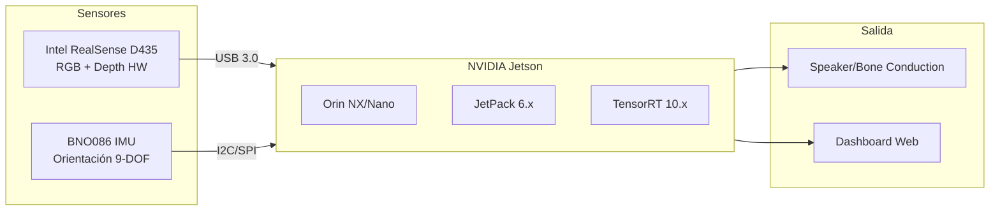
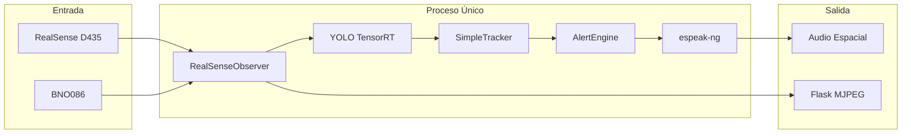

# ARIA Demo - Jetson Deployment

Documentación para desplegar ARIA Demo en NVIDIA Jetson con Intel RealSense D435 y BNO086 IMU.

## Hardware Target



## Arquitectura Simplificada

Sin Aria SDK = Sin conflictos CUDA = Proceso único posible



## Ventajas vs x86 + Aria

| Aspecto | x86 + Aria | Jetson + RealSense |
|---------|------------|-------------------|
| Modelos GPU | 3 (YOLO + Depth + Gaze) | 1 (solo YOLO) |
| Depth | IA (Depth Anything) | Hardware (IR stereo) |
| Eye Tracking | Sí (Aria cameras) | No |
| Procesos | 3 (main + detector + TTS) | 1 (single process) |
| CPU overhead | ~185% | ~50% estimado |
| Portabilidad | Requiere PC | Standalone |

## Componentes

### Intel RealSense D435

- **RGB**: 1920x1080 @ 30fps
- **Depth**: 1280x720 @ 30fps (hardware)
- **Rango**: 0.2m - 10m
- **FOV**: 87° x 58°

**Instalación Jetson:**
```bash
# librealsense para Jetson
git clone https://github.com/IntelRealSense/librealsense
cd librealsense
mkdir build && cd build
cmake .. -DFORCE_RSUSB_BACKEND=ON -DBUILD_PYTHON_BINDINGS=ON
make -j$(nproc)
sudo make install
```

### BNO086 IMU

- **9-DOF**: Acelerómetro + Giroscopio + Magnetómetro
- **Sensor Fusion**: Quaternion de orientación
- **Interfaz**: I2C (0x4A/0x4B) o SPI
- **Frecuencia**: Hasta 400Hz

**Uso potencial:**
- Detectar dirección de movimiento del usuario
- Compensar movimiento de cámara
- Alertas basadas en orientación ("coche a tu espalda")

**Instalación:**
```bash
pip install adafruit-circuitpython-bno08x
```

**Ejemplo básico:**
```python
import board
import adafruit_bno08x
from adafruit_bno08x.i2c import BNO08X_I2C

i2c = board.I2C()
bno = BNO08X_I2C(i2c)
bno.enable_feature(adafruit_bno08x.BNO_REPORT_ROTATION_VECTOR)

# En el loop
quat = bno.quaternion  # (w, x, y, z)
```

## Dockerfile.jetson

```dockerfile
# Base: JetPack 6.x con TensorRT
FROM nvcr.io/nvidia/l4t-tensorrt:r10.0.1-runtime

# librealsense
RUN apt-get update && apt-get install -y \
    libusb-1.0-0-dev \
    libglfw3-dev \
    && rm -rf /var/lib/apt/lists/*

# Python deps
RUN pip install \
    pyrealsense2 \
    adafruit-circuitpython-bno08x \
    ultralytics \
    flask \
    PyTurboJPEG

# App
WORKDIR /app
COPY . .

# TensorRT engine se genera en primera ejecución
CMD ["python", "run.py", "realsense"]
```

## Modo Single-Process

Para RealSense sin conflicto CUDA, podemos eliminar multiprocessing:

```python
# src/core/detector_lite.py (futuro)
class DetectorLite:
    """Detector sin multiprocessing para Jetson + RealSense."""

    def __init__(self):
        # Todo en el mismo proceso
        self.yolo = YOLO("yolo26s.engine")
        # Sin Depth Anything (RealSense tiene HW depth)
        # Sin Eye Gaze (RealSense no tiene eye cameras)

    def detect(self, rgb, depth_hw):
        # Inferencia directa, sin queues
        results = self.yolo(rgb)
        # Usar depth de hardware directamente
        return self._process_results(results, depth_hw)
```

## DeepStream (Opcional)

Si el rendimiento no es suficiente con Python, considerar DeepStream:

```
realsrc → nvvidconv → nvinfer(YOLO) → nvdsosd → appsink
```

**Ventajas:**
- Pipeline 100% GPU
- ~30% menos CPU que Python
- Plugins YOLO oficiales

**Desventajas:**
- Requiere C++ o Python-GStreamer
- Más complejo de mantener
- ~2 semanas de migración

## Rendimiento Esperado

| Métrica | Jetson Orin NX | Jetson Orin Nano |
|---------|----------------|------------------|
| YOLO FPS | ~45 | ~25 |
| CPU | ~50% | ~70% |
| VRAM | ~0.6 GB | ~0.6 GB |
| Potencia | 15W | 7W |

## TODO

- [ ] Crear Dockerfile.jetson
- [ ] Integrar BNO086 en RealSenseObserver
- [ ] Implementar DetectorLite (single-process)
- [ ] Probar TTS en Jetson (espeak-ng vs Piper)
- [ ] Benchmarks reales en hardware
- [ ] Evaluar DeepStream si Python no es suficiente
