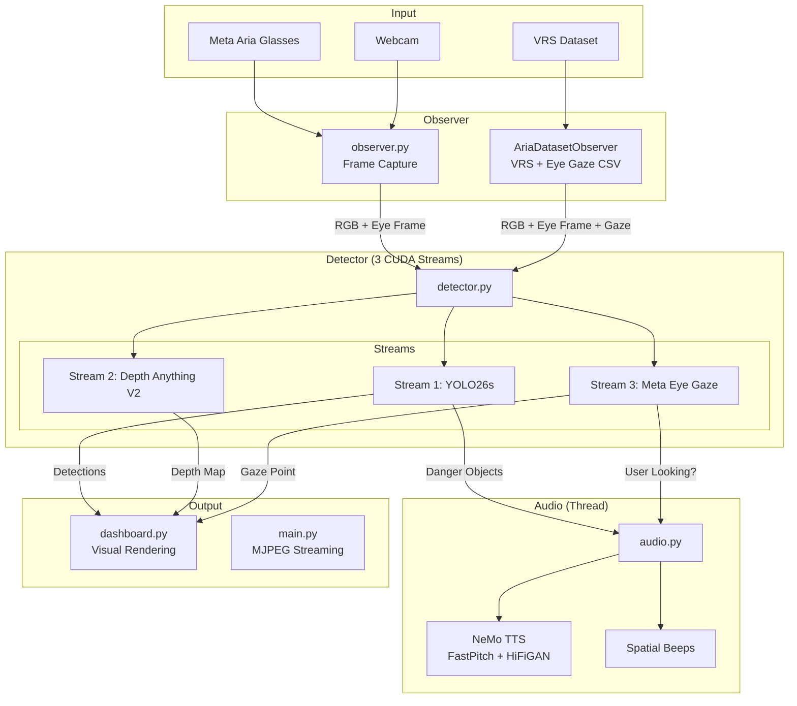
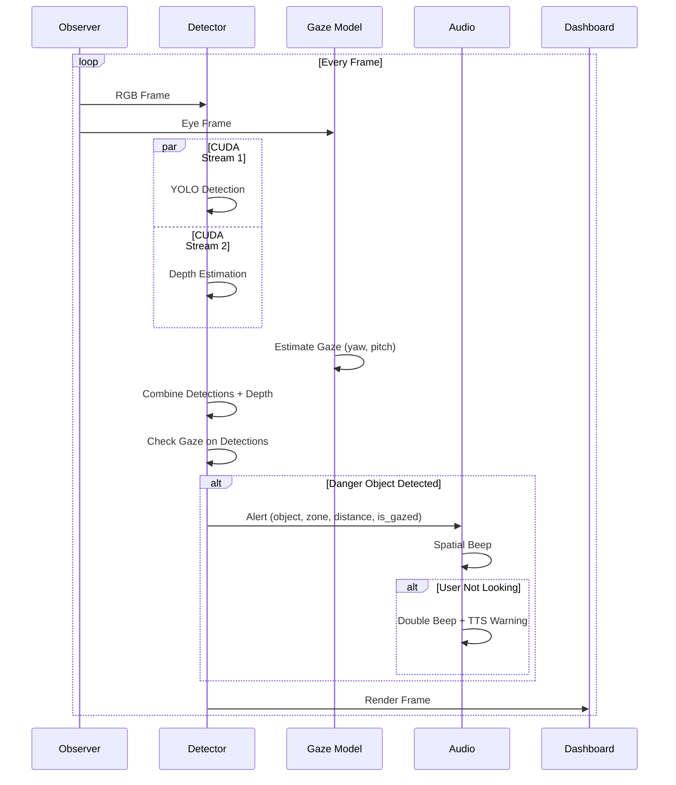
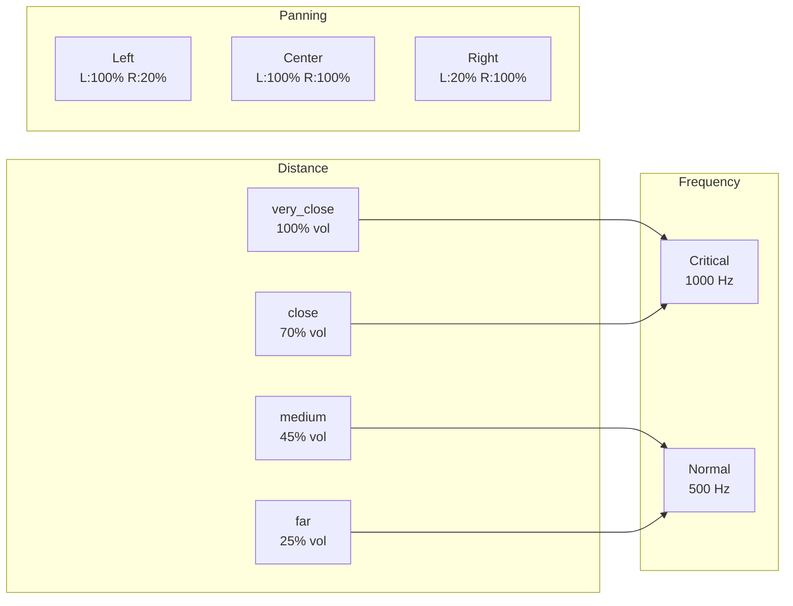
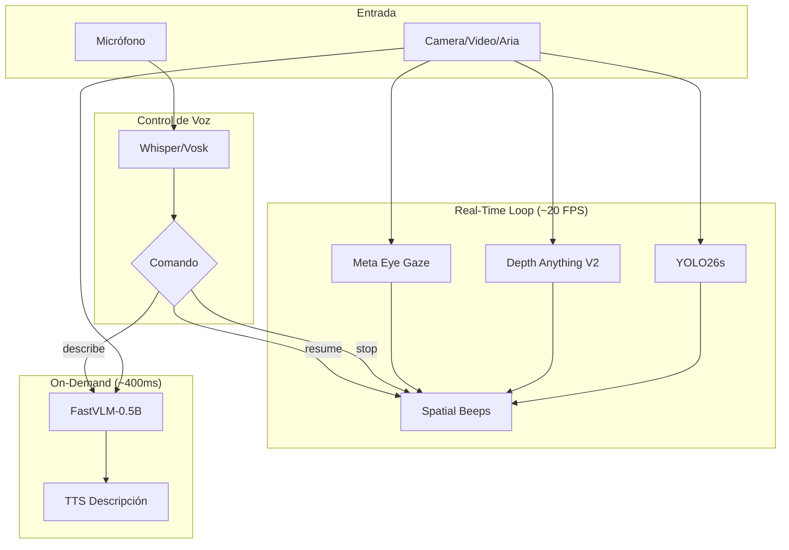
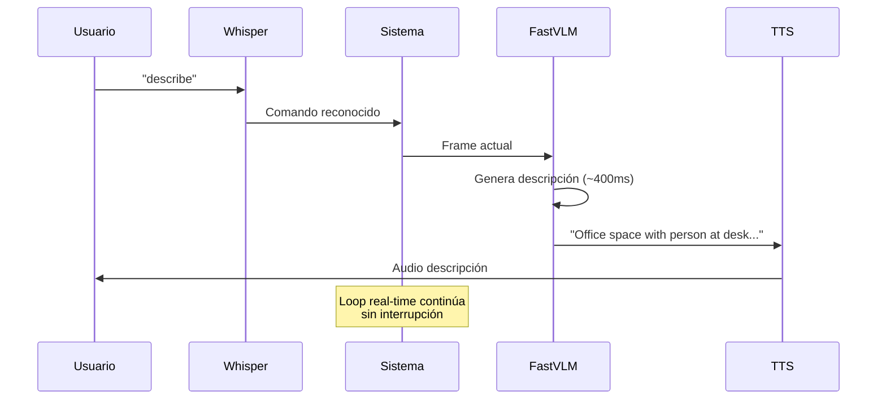
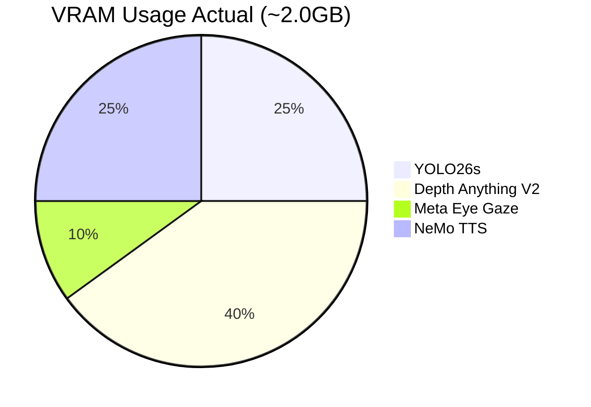

# ARIA Demo

Demo de asistencia visual para gafas Meta Aria: detección de objetos en tiempo real + estimación de profundidad + eye tracking + feedback audio espacial.

## Características

- **YOLO26s** - Detección de objetos con GPU (TensorRT/PyTorch)
- **Depth Anything V2** - Estimación de profundidad monocular (FP16/torch.compile)
- **Meta Eye Gaze** - Modelo oficial de Meta para estimación de mirada (`projectaria_eyetracking`)
- **NeMo TTS** - Síntesis de voz de alta calidad (FastPitch + HiFiGAN) en GPU
- **Audio Espacial** - Beeps direccionales (izq/centro/der) según posición del objeto
- **CUDA Streams** - YOLO, Depth y Gaze ejecutándose en paralelo (3 streams)
- **Gaze-Aware Alerts** - Alertas más intensas para objetos no vistos por el usuario
- **AriaDatasetObserver** - Reproducción de grabaciones VRS con eye gaze sincronizado
- **Modos de detección** - Indoor, Outdoor o All (80 clases COCO)

## Arquitectura



## Pipeline de Procesamiento



## Sistema de Audio

### NeMo TTS (NVIDIA)

Síntesis de voz de alta calidad usando:
- **FastPitch** - Generación de espectrogramas mel
- **HiFiGAN** - Vocoder neuronal

Corre en un **thread separado** con GPU (CUDA default stream). Cache automático de frases comunes.

Alertas: `"Warning, [objeto] [dirección]"` cuando hay peligro cercano que el usuario NO está mirando.

### Beeps Espaciales



## Estructura del Proyecto

```
aria-demo/
├── run.py                 # Entry point con selector de modo
├── src/
│   ├── core/
│   │   ├── observer.py    # Captura: Aria/Webcam/AriaDatasetObserver
│   │   ├── detector.py    # YOLO + Depth + Gaze (CUDA streams)
│   │   ├── dashboard.py   # Renderizado visual con OpenCV
│   │   └── audio.py       # NeMo TTS + beeps espaciales (CUDA stream)
│   └── web/
│       └── main.py        # Flask server + MJPEG streaming
├── data/
│   └── aria_sample/       # VRS recordings + eye_gaze CSV
├── models/                # YOLO weights (.pt, .engine)
├── docs/
│   └── README.md
└── requirements.txt
```

## Instalación

```bash
# Clonar/crear entorno
cd aria-demo
python -m venv .venv
source .venv/bin/activate

# Dependencias base
pip install -r requirements.txt

# Meta Eye Gaze Model (opcional, para gafas Aria)
pip install git+https://github.com/facebookresearch/projectaria_eyetracking.git

# Audio en Linux
sudo apt-get install -y libportaudio2 portaudio19-dev espeak-ng
```

## Uso

```bash
cd /home/roberto/Projects/aria/aria-demo
source .venv/bin/activate

python run.py webcam      # Webcam en tiempo real
python run.py dataset     # Reproducir VRS sample (data/aria_sample/)
python run.py video.mp4   # Archivo de video
```

Al arrancar, selecciona el modo de detección:
- **[1] Indoor** - persona, silla, sofá, mesa, tv, puerta...
- **[2] Outdoor** - persona, coche, bici, moto, bus, semáforo...
- **[3] All** - todas las clases (80 objetos COCO)

Abre http://localhost:5000 en el navegador.

## Detecciones

Cada objeto detectado incluye:

| Campo | Descripción |
|-------|-------------|
| `name` | Clase del objeto (person, chair, etc.) |
| `confidence` | Confianza de detección (0.0-1.0) |
| `bbox` | Bounding box (x, y, w, h) |
| `zone` | Zona espacial (left, center, right) |
| `distance` | Categoría de distancia (very_close, close, medium, far) |
| `depth_value` | Valor de profundidad normalizado (0.0-1.0) |
| `is_gazed` | True si el usuario está mirando el objeto |

## Rendimiento

Probado en RTX 3090:
- **15-19 FPS** con YOLO + Depth + Gaze (PyTorch)
- **~30 FPS** con TensorRT habilitado
- **~25 FPS** sin profundidad
- **~40 FPS** solo YOLO TensorRT

### Optimizaciones GPU

El sistema usa automáticamente:
- **TensorRT** para YOLO (exporta .engine si no existe)
- **TensorRT/torch.compile** para Depth
- **OpenCV CUDA** para resize/cvtColor (si está disponible)
- **3 CUDA Streams** para ejecución paralela:
  - Stream 1: YOLO detección
  - Stream 2: Depth estimation
  - Stream 3: Eye gaze inference
- **NeMo TTS** en thread separado (CUDA default stream)
- **FP16** para todos los modelos

## Dependencias

```
numpy>=1.24.0
opencv-python>=4.8.0
torch>=2.0.0
ultralytics>=8.0.0
transformers>=4.35.0
flask>=3.0.0
sounddevice>=0.4.6
Pillow>=10.0.0
nemo_toolkit[tts]>=2.0.0    # NeMo TTS (FastPitch + HiFiGAN)
```

### Opcionales

```bash
# TensorRT (más rendimiento)
pip install tensorrt torch-tensorrt

# Meta Eye Gaze (para Aria glasses)
pip install projectaria-tools
pip install git+https://github.com/facebookresearch/projectaria_eyetracking.git

# Fallback TTS (si no hay GPU para NeMo)
pip install pyttsx3

# OpenCV CUDA requiere compilar desde fuente
```

## Roadmap

### Próximo: Conexión Meta Aria Glasses
Integrar streaming en tiempo real desde las gafas Meta Aria físicas.

### Futuro: FastVLM + Control por Voz
FastVLM para descripciones de escena + comandos de voz (después de conectar Aria).

### Arquitectura Completa (Planned)



### Flujo de Voz



### Modelos y VRAM



Con FastVLM (futuro): ~3.2GB total

### Comandos de Voz (Planned)

| Comando | Acción |
|---------|--------|
| "describe" / "scan" | Descripción VLM detallada |
| "stop" | Pausar alertas de audio |
| "resume" | Reanudar alertas |
| "help" | Listar comandos disponibles |

## Créditos

- [Ultralytics YOLO](https://github.com/ultralytics/ultralytics)
- [Depth Anything V2](https://github.com/DepthAnything/Depth-Anything-V2)
- [NVIDIA NeMo](https://github.com/NVIDIA/NeMo) - FastPitch + HiFiGAN TTS
- [Meta Project Aria](https://www.projectaria.com/)
- [projectaria_eyetracking](https://github.com/facebookresearch/projectaria_eyetracking)
- [FastVLM](https://github.com/apple/ml-fastvlm) (planned)
